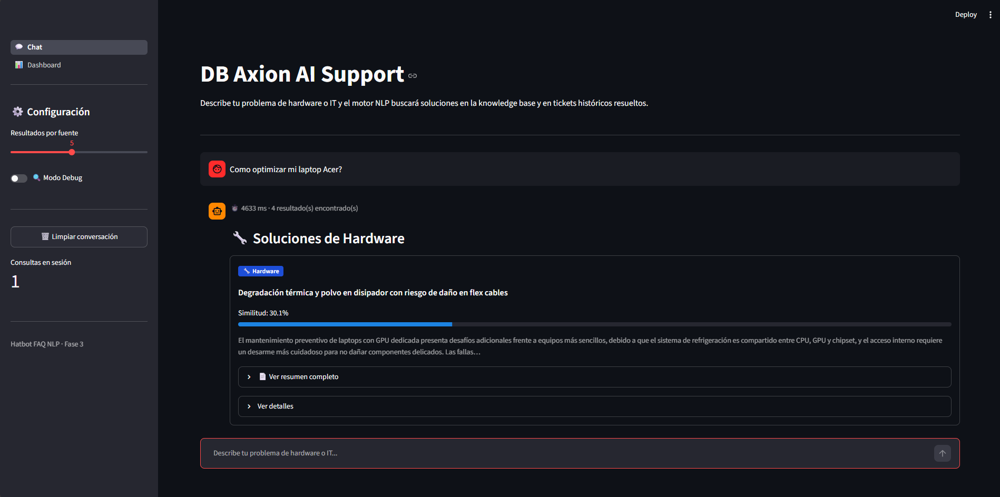
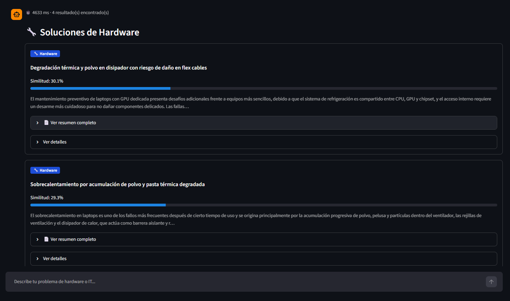
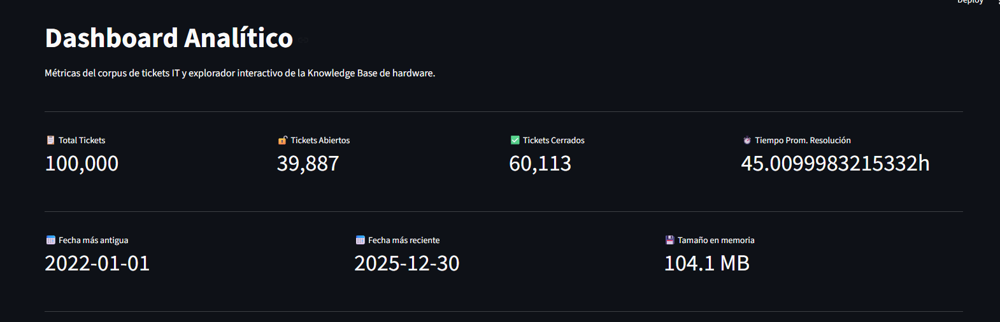
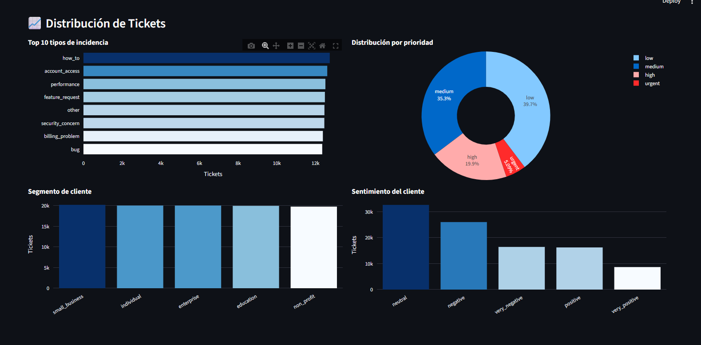
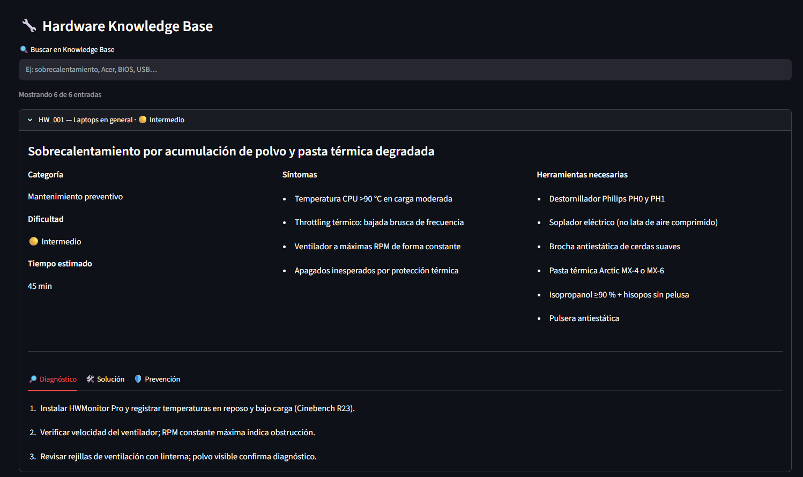
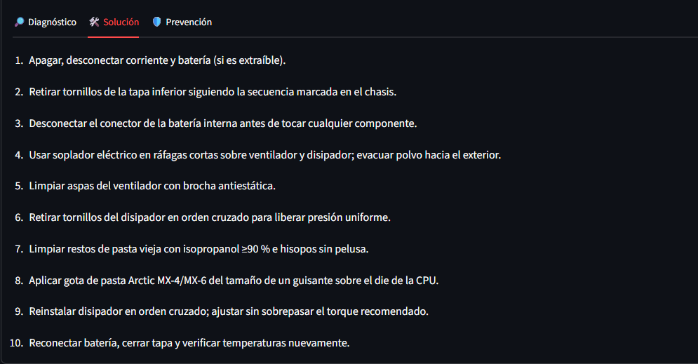
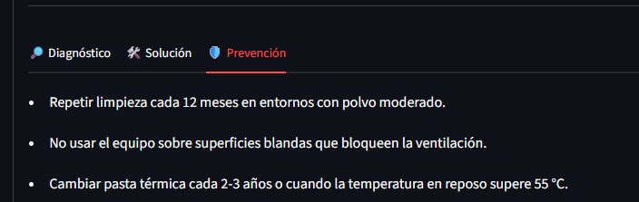

# 🤖 Hatbot FAQ NLP - Asistente de Soporte IT con Búsqueda Híbrida

<p align="center">
  
  
  
  
  
  
</p>

<p align="center">
  <strong>DB Axionics Tech Engineering</strong> &mdash; Daniel Alexander Brand Garcia
</p>

---

<p align="center">
  
</p>

<p align="center">
  <em>El asistente combinando resultados de Hardware Knowledge Base y tickets históricos similares</em>
</p>

---

## Contexto y Motivación

El soporte técnico de IT enfrenta un problema clásico: el conocimiento sobre diagnóstico y resolución de hardware está disperso en manuales, foros y la experiencia acumulada del equipo. Cada técnico reinventa la solución ante problemas que ya fueron resueltos antes.

**Hatbot FAQ NLP** nació para centralizar ese conocimiento en un asistente conversacional que:

1. Permite a cualquier técnico (o usuario final) describir su problema en lenguaje natural.
2. Recupera simultáneamente soluciones estructuradas de una Knowledge Base de hardware **y** tickets históricos ya resueltos.
3. Combina búsqueda semántica con recuperación por palabras clave en un modelo híbrido calibrado.
4. Expone los datos y la Knowledge Base en un dashboard analítico interactivo.

El dataset base son **100 000 tickets sintéticos** de soporte IT, procesados hasta un corpus vectorizado en formato `.npz` listo para búsqueda de similitud coseno en memoria.

---

## Características Principales

| Característica | Detalle |
|---|---|
| **Chat conversacional** | Interfaz `st.chat_input` con historial persistente en `session_state` |
| **Búsqueda híbrida** | Semántica (`all-MiniLM-L6-v2`) + TF-IDF con peso α=0.7 / 0.3 configurable |
| **Knowledge Base** | 15 entradas de hardware con 14 campos estructurados cada una |
| **Corpus de tickets** | 100 000 tickets vectorizados, filtrado a tickets cerrados (`is_open == False`) |
| **Dashboard analítico** | KPIs, 4 gráficos Plotly, explorador de KB con búsqueda en tiempo real |
| **Caché inteligente** | `@st.cache_data(ttl=3600)` en todas las cargas pesadas |
| **Multi-página** | `st.navigation()` (Streamlit ≥ 1.36) con fallback para versiones anteriores |
| **Logging estructurado** | `logging.getLogger(__name__)` + `logger.exception()` en cada bloque de error |

<details>
<summary>📸 Ver capturas de la interfaz de chat</summary>
<br>

<p align="center">
  
</p>
<p align="center"><em>Tarjetas de resultado con score de similitud, resumen del embedding_text y acceso a diagnóstico, solución y prevención</em></p>

</details>

---

## Arquitectura por Fases

```
╔══════════════════════════════════════════════════════════════════╗
║  FASE 1 - Ingeniería de Datos (data_processor.py)               ║
║                                                                  ║
║  CSV crudo (100k filas)                                          ║
║       │  load_and_clean_tickets()                                ║
║       │  · Tipado nullable (StringDtype, BooleanDtype, etc.)     ║
║       │  · Columnas derivadas: is_open, schema_version           ║
║       ▼                                                          ║
║  tickets_clean.parquet  [fastparquet / snappy]                   ║
╠══════════════════════════════════════════════════════════════════╣
║  FASE 2 - Motor NLP (nlp_engine.py)                             ║
║                                                                  ║
║  hardware_knowledge_base.json  +  tickets_clean.parquet          ║
║       │  generate_embeddings()  →  all-MiniLM-L6-v2             ║
║       │  · L2-normalización → coseno vía np.dot()               ║
║       │  · TfidfVectorizer sobre campo 'keywords'                ║
║       ▼                                                          ║
║  hw_embeddings.npz (15×384)  +  ticket_embeddings.npz (100k×384)║
╠══════════════════════════════════════════════════════════════════╣
║  FASE 3 - Frontend Streamlit                                     ║
║                                                                  ║
║  main_chat.py ──► retrieve_relevant_knowledge(query, top_k)      ║
║       │              hybrid_search() + semantic_search()         ║
║       ├── 💬 Chat page    (st.chat_input, historial)             ║
║       └── 📊 Dashboard    (dashboard_ui.py)                      ║
║               ├── KPIs + gráficos Plotly                         ║
║               └── KB Explorer (búsqueda + expanders)            ║
╠══════════════════════════════════════════════════════════════════╣
║  FASE 4 - Enriquecimiento de Knowledge Base                      ║
║                                                                  ║
║  6 entradas originales  →  15 entradas completamente pobladas    ║
║  Todos los campos: sintomas, keywords, pasos_diagnostico,        ║
║  pasos_solucion, prevencion, herramientas, referencias           ║
╚══════════════════════════════════════════════════════════════════╝
```

| Fase | Módulo principal | Artefacto de salida |
|------|-----------------|---------------------|
| 1 - ETL | `src/data_processor.py` | `data/processed/tickets_clean.parquet` |
| 2 - NLP | `src/nlp_engine.py` | `data/processed/hw_embeddings.npz`, `ticket_embeddings.npz` |
| 3 - UI | `app/main_chat.py`, `app/dashboard_ui.py` | Aplicación Streamlit multi-página |
| 4 - KB | `data/custom/hardware_knowledge_base.json` | 15 entradas con 14 campos c/u |

### Vista del Dashboard Analítico

<p align="center">
  
</p>

<p align="center">
  <em>100 000 tickets procesados: 39 887 abiertos · 60 113 cerrados · tiempo promedio de resolución · rango de fechas 2022–2025</em>
</p>

<p align="center">
  
</p>

<p align="center">
  <em>Distribución por tipo de incidencia (top 10), prioridad (donut hole=0.45), segmento y sentimiento del cliente</em>
</p>

---

## Estructura del Proyecto

```
hatbot-faq-nlp/
│
├── app/
│   ├── __init__.py
│   ├── main_chat.py          # Entry point: navegación, chat, session_state
│   └── dashboard_ui.py       # Dashboard analítico: KPIs, gráficos, KB Explorer
│
├── data/
│   ├── raw/
│   │   └── synthetic_it_support_tickets.csv   # Dataset fuente (100 000 tickets)
│   ├── processed/
│   │   ├── tickets_clean.parquet              # ETL output (fastparquet/snappy)
│   │   ├── hw_embeddings.npz                  # Índice semántico hardware (15×384)
│   │   └── ticket_embeddings.npz              # Índice semántico tickets (100k×384)
│   └── custom/
│       └── hardware_knowledge_base.json       # 15 entradas, 14 campos c/u
│
├── src/
│   ├── data_processor.py     # ETL, tipado, estadísticas, creación de KB
│   └── nlp_engine.py         # Embeddings, búsqueda semántica, híbrida y keyword
│
├── requirements.txt           # Dependencias completas (todas las fases)
├── requirements-phase1.txt    # Fase 1: pandas, numpy, fastparquet, pyarrow
├── requirements-phase2.txt    # Fase 2: sentence-transformers, scikit-learn
├── requirements-phase3.txt    # Fase 3: streamlit, plotly
└── Embeddings_HW_001_a_HW_015.pdf.pdf   # Documento fuente de la KB
```

---

## Instalación y Ejecución

### Prerrequisitos

- Python 3.13+
- `pip` actualizado

### Instalación por fases (recomendado)

```bash
# Clonar el repositorio
git clone https://github.com/DBAxionicsTech/hatbot-faq-nlp.git
cd hatbot-faq-nlp

# Fase 1 — Dependencias de datos
pip install -r requirements-phase1.txt

# Fase 2 — Motor NLP
pip install -r requirements-phase2.txt

# Fase 3 — Frontend
pip install -r requirements-phase3.txt
```

### Instalación completa (una línea)

```bash
pip install -r requirements.txt
```

### Pipeline de datos (primera ejecución)

```bash
# 1. Procesar el dataset y generar el Parquet
python src/data_processor.py

# 2. Construir los índices de embeddings
python src/nlp_engine.py --build-index

# 3. (Opcional) Reconstruir forzando regeneración
python src/nlp_engine.py --build-index --force
```

### Lanzar la aplicación

```bash
streamlit run app/main_chat.py
```

La app estará disponible en `http://localhost:8501`.

### Buscar desde CLI

```bash
# Búsqueda híbrida desde terminal
python src/nlp_engine.py --query "laptop se apaga sola por calor" --top-k 5
```

---

## Cómo Funciona

### Flujo de una consulta

```
Usuario escribe consulta
        │
        ▼
retrieve_relevant_knowledge(query, top_k)
        │
        ├──► hybrid_search(query)          # Sobre la Hardware KB
        │         │
        │         ├── semantic_search("hardware")   # Coseno sobre hw_embeddings.npz
        │         └── keyword_search()              # TF-IDF sobre campo 'keywords'
        │         │
        │         └── score_final = α·sem + (1-α)·kw   # α = 0.7
        │
        └──► semantic_search("tickets", only_closed=True)   # Sobre ticket_embeddings.npz
                  │
                  └── Filtro: is_open == False
```

### Fórmula de búsqueda híbrida

```
score_final = 0.7 × score_semántico + 0.3 × score_keyword
```

- **score_semántico**: similitud coseno entre query vector y cada entrada de la KB, calculada como `np.dot(matrix, query_vec)` sobre vectores L2-normalizados.
- **score_keyword**: TF-IDF coseno sobre el campo `keywords` de cada entrada.
- Los resultados se deduplicam por `id`, se ordenan descendentemente y se truncan a `top_k`.

### Formato de respuesta

```python
{
    "query":            str,           # Consulta original
    "hardware_results": list[dict],    # Resultados de la KB con score híbrido
    "ticket_results":   list[dict],    # Tickets similares cerrados
    "total_results":    int,
    "search_time_ms":   float,
}
```

---

## Knowledge Base de Hardware

La KB contiene **15 entradas** completamente estructuradas, cada una con **14 campos**: `id`, `categoria`, `modelo_equipo`, `problema`, `sintomas`, `keywords`, `herramientas_necesarias`, `pasos_diagnostico`, `pasos_solucion`, `tiempo_estimado_minutos`, `nivel_dificultad`, `prevencion`, `referencias` y `embedding_text`.

| ID | Problema | Categoría | Dificultad | Tiempo |
|----|----------|-----------|:----------:|:------:|
| HW_001 | Sobrecalentamiento por polvo y pasta térmica degradada | Mantenimiento preventivo | 🟡 Intermedio | 45 min |
| HW_002 | Degradación térmica y polvo con riesgo en flex cables (Asus X441UV) | Mantenimiento preventivo | 🟡 Intermedio | 60 min |
| HW_003 | Fallo en fuente de alimentación interna con capacitores hinchados (Monitores Janus) | Diagnóstico energético | 🔴 Avanzado | 90 min |
| HW_004 | Fallo de POST por configuración BIOS corrupta o pila CR2032 agotada | Firmware y BIOS | 🟡 Intermedio | 30 min |
| HW_005 | Throttling térmico detectado con HWMonitor Pro y Cinebench R23 | Diagnóstico térmico | 🟡 Intermedio | 40 min |
| HW_006 | Creación de USB bootable multiherramienta para diagnóstico de hardware | Herramientas de diagnóstico USB | 🟢 Básico | 120 min |
| HW_007 | Diagnóstico y fallas en discos duros y SSDs | Diagnóstico de almacenamiento | 🟡 Intermedio | 60 min |
| HW_008 | Problemas de batería y sistema de carga en laptops | Diagnóstico de alimentación | 🟡 Intermedio | 30 min |
| HW_009 | Fallas en fuentes de poder ATX de escritorio | Diagnóstico energético | 🟡 Intermedio | 45 min |
| HW_010 | Diagnóstico avanzado de fallas de memoria RAM | Diagnóstico de memoria | 🟢 Básico | 90 min |
| HW_011 | No enciende y problemas de POST en computadoras | Diagnóstico de arranque | 🟡 Intermedio | 60 min |
| HW_012 | Problemas de imagen y retroiluminación en monitores | Diagnóstico de pantalla | 🔴 Avanzado | 60 min |
| HW_013 | Problemas de puertos USB y dispositivos externos | Diagnóstico de conectividad | 🟢 Básico | 30 min |
| HW_014 | Recuperación básica y prevención de pérdida de datos | Recuperación de datos | 🟡 Intermedio | 120 min |
| HW_015 | Buenas prácticas de mantenimiento preventivo general | Mantenimiento preventivo | 🟢 Básico | 60 min |

> 🟢 Básico · 🟡 Intermedio · 🔴 Avanzado

### Vista del KB Explorer

<p align="center">
  
</p>

<p align="center">
  <em>Cada entrada muestra categoría, dificultad, síntomas, herramientas necesarias y tabs de Diagnóstico / Solución / Prevención</em>
</p>

<p align="center">
  
</p>

<p align="center">
  <em>Tab Solución: 10 pasos detallados para limpieza de polvo y reemplazo de pasta térmica en laptops</em>
</p>

<p align="center">
  
</p>

<p align="center">
  <em>Tab Prevención: medidas de mantenimiento periódico para prolongar la vida útil del equipo</em>
</p>

---

## Tecnologías Utilizadas

### Datos y ETL

| Librería | Versión mínima | Uso |
|----------|:--------------:|-----|
| `pandas` | ≥ 2.0 | ETL, tipado nullable, estadísticas |
| `numpy` | ≥ 1.24 | Operaciones matriciales, similitud coseno |
| `fastparquet` | ≥ 2023.4 | Serialización Parquet con compresión snappy |
| `pyarrow` | ≥ 12.0 | Backend de lectura Parquet |
| `python-dotenv` | ≥ 1.0 | Gestión de variables de entorno |

### Motor NLP

| Librería | Versión mínima | Uso |
|----------|:--------------:|-----|
| `sentence-transformers` | ≥ 2.2 | Modelo `all-MiniLM-L6-v2`, embeddings 384-dim |
| `scikit-learn` | ≥ 1.3 | `TfidfVectorizer` para búsqueda por palabras clave |
| `spacy` | ≥ 3.6 | Procesamiento lingüístico (modelo `es_core_news_sm`) |
| `tqdm` | ≥ 4.65 | Progreso en generación de embeddings por lotes |

### Frontend y Visualización

| Librería | Versión mínima | Uso |
|----------|:--------------:|-----|
| `streamlit` | ≥ 1.30 | Framework de UI (multi-página con `st.navigation()`) |
| `plotly` | ≥ 5.18 | Gráficos interactivos: barras H/V y donut charts |
| `rich` | ≥ 13.0 | Salida colorida en CLI y scripts de diagnóstico |

**Modelo de lenguaje:** `sentence-transformers/all-MiniLM-L6-v2`
- Dimensión de embedding: **384**
- Índice hardware: shape `(15, 384)`
- Índice tickets: shape `(100 000, 384)`
- Normalización: L2 → similitud coseno por `np.dot()`

---

## Decisiones de Diseño

### 1. Pandas nullable dtypes en lugar de dtypes clásicos

Se eligieron `pd.StringDtype()`, `pd.BooleanDtype()`, `pd.Float32Dtype()` e `pd.Int16Dtype()` para todas las columnas del dataset en lugar de los dtypes de NumPy (`object`, `bool`, `float64`). Esto permite representar `NA` nativo sin colapsar a `NaN` (float), reducir el uso de memoria un ~40% en columnas de baja cardinalidad y hacer explícita la semántica de cada columna en el esquema.

```python
TICKET_DTYPES = {
    "ticket_id":          pd.StringDtype(),
    "priority":           "category",
    "resolution_time_hours": pd.Float32Dtype(),
    "csat_score":         pd.Int16Dtype(),
    "reopened":           pd.BooleanDtype(),
    # …
}
```

### 2. Embeddings pre-normalizados + np.dot() para similitud coseno

Los embeddings se generan con `normalize_embeddings=True` en `model.encode()`, por lo que cada vector ya tiene norma 1. La similitud coseno se reduce entonces a un producto punto: `np.dot(matrix, query_vec)`. Esto elimina la necesidad de una librería de búsqueda vectorial especializada para 15–100 000 vectores y mantiene la inferencia completamente en memoria con NumPy.

### 3. `retrieve_relevant_knowledge()` como única API pública entre capas

Todo el frontend (chat y dashboard) invoca únicamente esta función. Cualquier cambio interno al motor NLP (reemplazar TF-IDF por BM25, cambiar el modelo de embeddings, ajustar el umbral) no requiere modificar ningún archivo de UI. El contrato de la función es estable: recibe `query: str` y `top_k: int | None`, retorna un dict con cinco claves fijas.

### 4. Dashboard 100% Plotly (eliminación de Altair)

El dashboard se refactorizó para eliminar la dependencia de Altair y unificar toda la visualización en Plotly Express. Se creó `_PLOTLY_LAYOUT` como dict compartido para que los tres tipos de gráfico (barras horizontales, barras verticales y donut) mantengan márgenes, altura y fondos transparentes idénticos. Esto reduce las dependencias, simplifica el mantenimiento y garantiza coherencia visual sin CSS adicional.

---

## Mejoras Futuras

- [ ] **Fase 5 — LLM generativo**: integrar un modelo de lenguaje (GPT-4o, Claude 3.5) para generar respuestas en prosa a partir de los resultados del motor híbrido, en lugar de mostrar tarjetas estructuradas.
- [ ] **Reranking con cross-encoder**: añadir un segundo paso de reranking con un modelo `cross-encoder/ms-marco-MiniLM-L-6-v2` para mejorar la precisión sin aumentar el tiempo de indexación.
- [ ] **Expansión de la Knowledge Base**: incorporar categorías de software (reinstalación de SO, drivers, actualizaciones), redes y periféricos con la misma estructura de 14 campos.
- [ ] **Persistencia de historial**: guardar el historial de conversaciones en SQLite para análisis posterior y mejora continua del sistema.
- [ ] **Autenticación**: añadir login básico con `streamlit-authenticator` para entornos corporativos.
- [ ] **Tests unitarios**: cobertura con `pytest` para `data_processor.py` (ETL) y `nlp_engine.py` (búsqueda, scores, normalización).
- [ ] **CI/CD**: pipeline GitHub Actions para validar el JSON de la KB, ejecutar tests y desplegar en Streamlit Community Cloud.
- [ ] **BM25**: reemplazar TF-IDF por BM25 (`rank_bm25`) en el componente keyword del híbrido para mayor robustez en consultas cortas.

---

## Autor

<table>
  <tr>
    <td><strong>Organización</strong></td>
    <td>DB Axionics Tech Engineering</td>
  </tr>
  <tr>
    <td><strong>Nombre</strong></td>
    <td>Daniel Alexander Brand Garcia</td>
  </tr>
  <tr>
    <td><strong>Proyecto</strong></td>
    <td>Hatbot FAQ NLP - Portafolio de Ingeniería de Datos y NLP</td>
  </tr>
  <tr>
    <td><strong>Stack principal</strong></td>
    <td>Python 3.13 · Streamlit · sentence-transformers · Plotly · pandas</td>
  </tr>
</table>

---

<p align="center">
  <em>DB Axionics Tech Engineering &mdash; Hatbot FAQ NLP &mdash; 2026</em>
</p>
